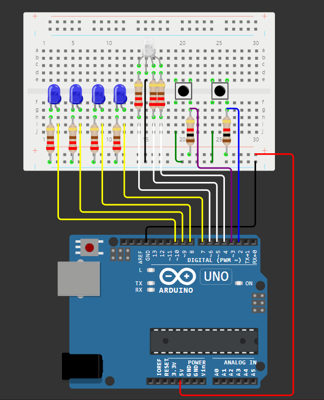

# Tema 1: EV Charger

## Descrierea task-ului

## Componentele utilizate
* 4x LED-uri albastre
Afiseaza nivelul de încărcare, fiecare reprezentând 25%.
* 1x LED RGB
Afiseaza starea stației, verde - liberă, roșu - ocupată.
* 2x Butoane
Au ca scop pornirea sau oprirea stației de încărcare.
* 7x Rezistoare 220Ω
Sunt folosite la LED-uri.
* 2x Rezistoare 1KΩ
Sunt folosite la butoane.
* 1x Breadboard
Pe acesta este făcut montajul fizic.
* 14x Cabluri de legătură
Sunt folosite la conectarea elementelor montajului.

## Imagini cu montajul fizic:

## Schema electrică:

## Video cu funcționalitatea montajului fizic:
[Link video](https://youtu.be/XKGqLv5ohrE?si=sBJzTCmdPMsX9j7X)
