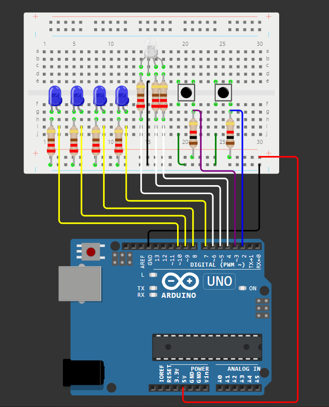

# Tema 1: EV Charger

## Descrierea task-ului

## Componentele utilizate

## Imagini cu montajul fizic:

## Schema electrică:

## Video cu funcționalitatea montajului fizic:
[Link video](https://youtu.be/XKGqLv5ohrE?si=sBJzTCmdPMsX9j7X)
