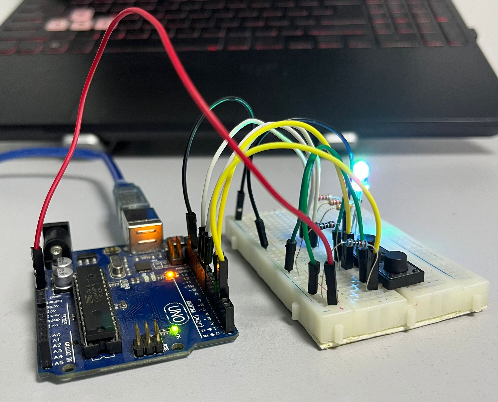
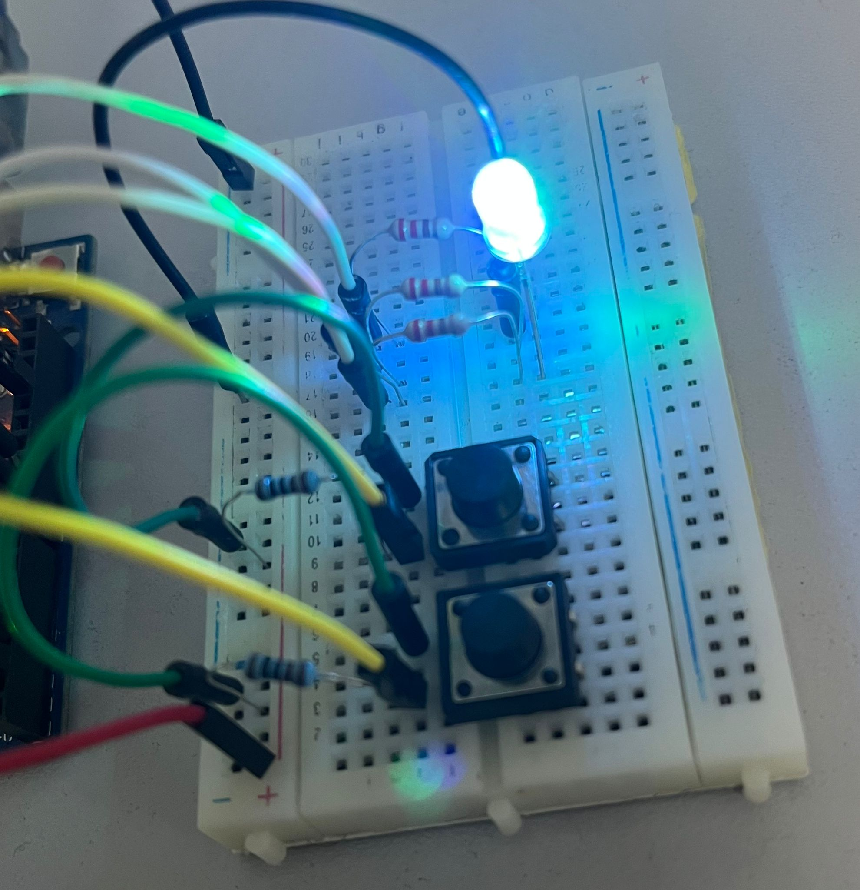
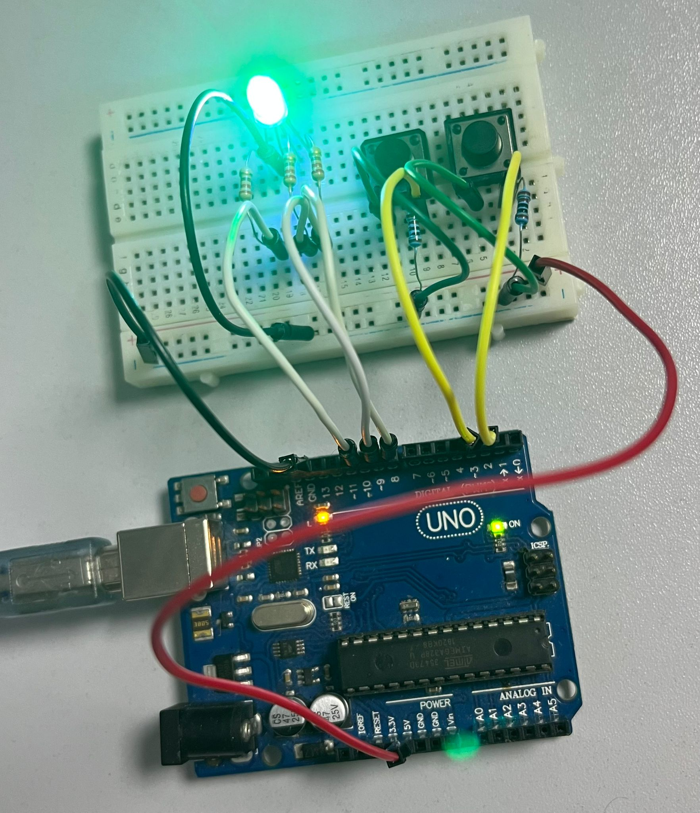

# Tema 2: TypeRacer Game

## Descrierea task-ului
În cadrul acestei teme am realizat un joc asemănător cu TypeRacer. Înainte ca jocul să inceapa trebuie să selectăm dificultatea cu ajutorul unui buton specific, care cicleaza prin Easy, Medium și Hard. Dificultatea va fi afișată și în terminal, alături de numărul de secunde disponibile pentru fiecare cuvânt. Jocul va începe când vom apăsa pe butonul de start (care poate fi folosit și să oprească jocul imediat). La pornirea jocului, LED-ul RGB va lumina de 3 ori și va începe o numărătoare înversă, după care utilizatorul va primi cuvinte în terminal. Dacă acesta greșește cuvântul, LED-ul se va face roșu până la tastarea corectă a acestuia, sau la schimbarea cuvântului. Jocul se termină după 30 de secunde, când în terminal va fi afișat numărul de cuvinte scrise corect.

## Componentele utilizate
* 1x LED RGB - este folosit pentru a arăta starea jocului și dacă cuvintele au fost scrise corect sau nu.
* 2x Butoane - sunt folosite pentru a porni/opri jocul, dar și pentru a schimba dificultatea.
* 3x Rezistoare 220Ω - sunt folosite la LED-ul RGB.
* 2x Rezistoare 1KΩ - sunt folosite la butoane.
* 1x Breadboard - pe acesta este făcut întreg montajul fizic.
* 10x Cabluri de legătură - sunt folosite la conectarea elementelor montajului.

## Imagini cu montajul fizic:

## Schema electrică:

## Video cu funcționalitatea montajului fizic:
[Link video](https://youtu.be/oxtoXBxYIbg)