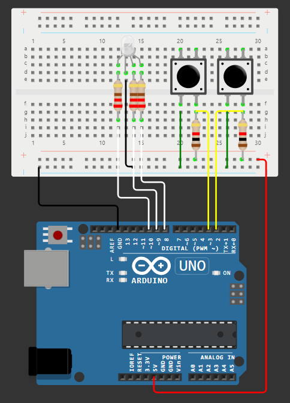

# Tema 2: TypeRacer Game

## Descrierea task-ului

## Componentele utilizate
* 1x LED RGB - este folosit pentru a arăta starea jocului și dacă cuvintele au fost scrise corect sau nu.
* 2x Butoane - sunt folosite pentru a porni/opri jocul, dar și pentru a schimba dificultatea.
* 3x Rezistoare 220Ω - sunt folosite la LED-ul RGB.
* 2x Rezistoare 1KΩ - sunt folosite la butoane.
* 1x Breadboard - pe acesta este făcut întreg montajul fizic.
* 10x Cabluri de legătură - sunt folosite la conectarea elementelor montajului.

## Imagini cu montajul fizic:

## Schema electrică:

## Video cu funcționalitatea montajului fizic:
