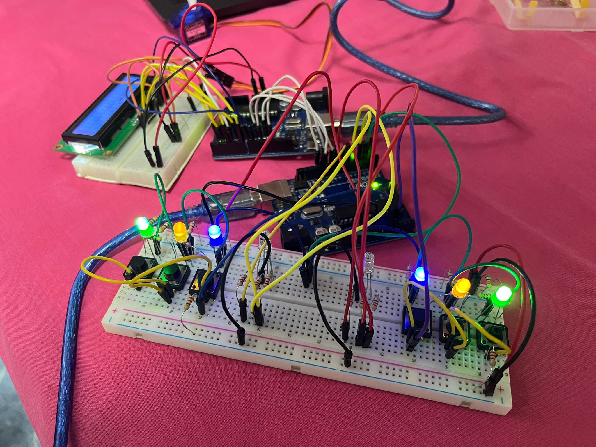
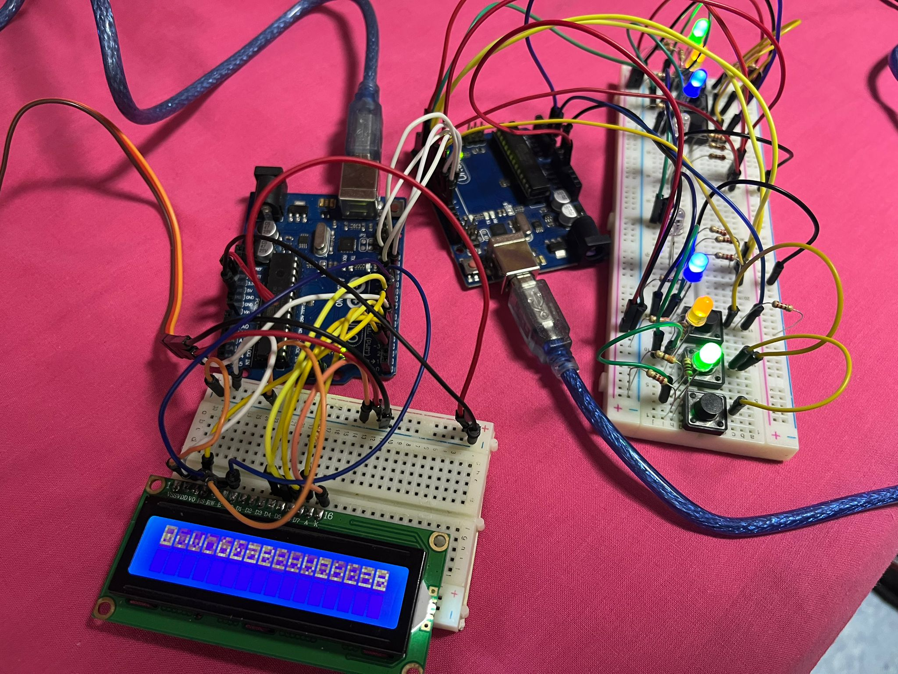

# Tema 3: Quick Time

## Descrierea task-ului
a

## Componentele utilizate
* 1x LCD - afișează numele și scorul jucătorilor
* 2x LED RGB - sunt folosite pentru a arăta culoarea care trebuie apăsată.
* 6x Butoane - sunt folosite pentru a trimite un semnal cu culoarea corespunzătoare.
* 6x LED-uri - sunt folosite pentru a determina culoarea corespunzătoare fiecărui buton.
* 1x Servomotor - contorizează timpul unui meci.
* 14x Rezistoare 220Ω
* 7x Rezistoare 330Ω
* 2x Breadboard - pe acestea este făcut întreg montajul fizic.
* Cabluri de legătură - sunt folosite la conectarea elementelor montajului.
* 2x Arduino Uno

## Imagini cu montajul fizic:

